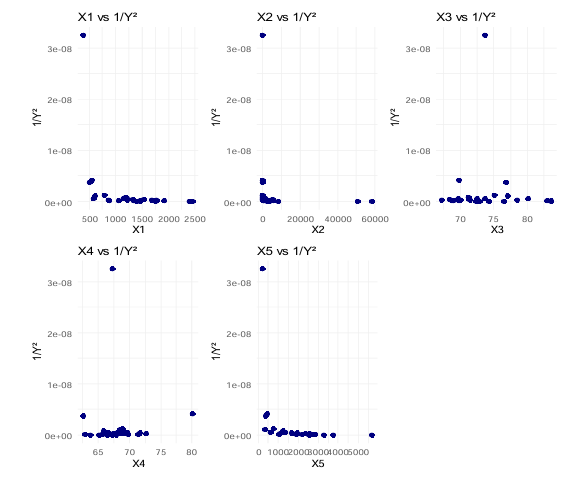
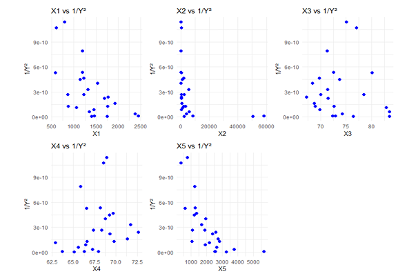

# igrm-diagnostic-techniques
R-based diagnostic techniques for identifying influential observations in Inverse Gaussian Regression Models.
# Diagnostic Techniques for Inverse Gaussian Regression Model

This repository contains R implementations of diagnostic methods for identifying influential observations in the Inverse Gaussian Regression Model (IGRM).

## Methods
- Leverage
- Pearson Residual 
- Cook’s Distance
- Welsch Distance (WD)
- Covariance Ratio (CVR)

## Tools
- R
- Newton–Raphson algorithm

## Case Study
- Gross Regional Domestic Product (PDRB)

- ### 🔤 Visualisasi
Berikut **Plot** yang dihasilkan:

## Author
Nabila Nadhifa
